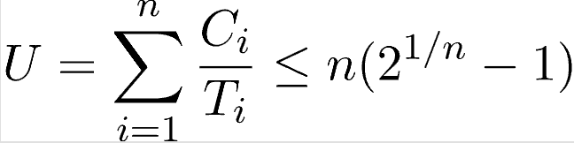

# xv6 Kernel Modifications

This repository contains custom modifications to the xv6 operating system. The project focuses on the implementation of the following system calls and features:

1. **Message Passing (send/receive system calls)**
2. **`getppid()` system call**
3. **`ps` system call (process status)**

Each system call has been implemented with detailed modifications in the respective kernel files.

---

## Features Implemented

### 1. Message Passing (send/receive)
Message passing allows inter-process communication (IPC) using a message queue.

**Modified Files:**
- `msgqueue.h` (New)
- `sysproc.c`
- `syscall.h`
- `syscall.c`
- `user.h`
- `usys.S`

**Code Changes:**

#### `msgqueue.h` (New File)
```c
#ifndef MSGQUEUE_H
#define MSGQUEUE_H

#include "param.h"
#include "spinlock.h"

#define MAX_MESSAGES 64
#define MSG_SIZE 128

struct message {
    int type;
    char data[MSG_SIZE];
};

struct message_queue {
    struct spinlock lock;
    struct message messages[MAX_MESSAGES];
    int head;
    int tail;
    int count;
};

#endif
```

#### Changes in `sysproc.c`
```c
#include "msgqueue.h"

static struct message_queue msgq;

// Initialize the message queue
void msgqueue_init(void) {
    initlock(&msgq.lock, "msgqueue");
    msgq.head = 0;
    msgq.tail = 0;
    msgq.count = 0;
}

// `send` system call
int sys_send(void) {
    int type;
    char *msg;

    if (argint(0, &type) < 0 || argptr(1, &msg, MSG_SIZE) < 0) {
        return -1;
    }

    acquire(&msgq.lock);
    if (msgq.count == MAX_MESSAGES) {
        release(&msgq.lock);
        return -1;
    }

    msgq.messages[msgq.tail].type = type;
    safestrcpy(msgq.messages[msgq.tail].data, msg, MSG_SIZE);
    msgq.tail = (msgq.tail + 1) % MAX_MESSAGES;
    msgq.count++;
    release(&msgq.lock);
    return 0;
}

// `receive` system call
int sys_recv(void) {
    int type;
    char *msg;

    if (argint(0, &type) < 0 || argptr(1, &msg, MSG_SIZE) < 0) {
        return -1;
    }

    acquire(&msgq.lock);
    for (int i = 0; i < msgq.count; i++) {
        int index = (msgq.head + i) % MAX_MESSAGES;
        if (msgq.messages[index].type == type) {
            safestrcpy(msg, msgq.messages[index].data, MSG_SIZE);
            for (int j = index; j != msgq.tail; j = (j + 1) % MAX_MESSAGES) {
                msgq.messages[j] = msgq.messages[(j + 1) % MAX_MESSAGES];
            }
            msgq.tail = (msgq.tail - 1 + MAX_MESSAGES) % MAX_MESSAGES;
            msgq.count--;
            release(&msgq.lock);
            return 0;
        }
    }

    release(&msgq.lock);
    return -1;
}
```

#### Changes in `syscall.h`
```c
#define SYS_send 22
#define SYS_recv 23
```

#### Changes in `syscall.c`
```c
extern int sys_send(void);
extern int sys_recv(void);

[SYS_send] sys_send,
[SYS_recv] sys_recv,
```

#### Changes in `user.h`
```c
int send(int type, char *msg);
int recv(int type, char *msg);
```

#### Changes in `usys.S`
```asm
SYSCALL(send)
SYSCALL(recv)
```

---

### 2. `getppid` System Call
This system call retrieves the parent process ID of the current process.

**Modified Files:**
- `sysproc.c`
- `syscall.h`
- `syscall.c`
- `user.h`
- `usys.S`

**Code Changes:**

#### Changes in `sysproc.c`
```c
int sys_getppid(void) {
    return myproc()->parent->pid;
}
```

#### Changes in `syscall.h`
```c
#define SYS_getppid 24
```

#### Changes in `syscall.c`
```c
extern int sys_getppid(void);

[SYS_getppid] sys_getppid,
```

#### Changes in `user.h`
```c
int getppid(void);
```

#### Changes in `usys.S`
```asm
SYSCALL(getppid)
```

---

### 3. `ps` System Call (Process Status)
This system call lists all processes and their states.

**Modified Files:**
- `proc.c`
- `syscall.h`
- `syscall.c`
- `user.h`
- `usys.S`

**Code Changes:**

#### Changes in `proc.c`
```c
int sys_ps(void) {
    struct proc *p;
    acquire(&ptable.lock);
    cprintf("PID	State		Name
");
    for (p = ptable.proc; p < &ptable.proc[NPROC]; p++) {
        if (p->state != UNUSED) {
            cprintf("%d	%s	%s
", p->pid, states[p->state], p->name);
        }
    }
    release(&ptable.lock);
    return 0;
}
```

#### Changes in `syscall.h`
```c
#define SYS_ps 25
```

#### Changes in `syscall.c`
```c
extern int sys_ps(void);

[SYS_ps] sys_ps,
```

#### Changes in `user.h`
```c
int ps(void);
```

#### Changes in `usys.S`
```asm
SYSCALL(ps)
```

---


### Compilation Instructions

1. Clone the xv6 repository and navigate to the directory.
2. Apply the changes to the respective files as listed above.
3. Build the kernel using:
   ```bash
   make clean && make qemu
   ```

---

## Examples

### Testing `send` and `recv`
Run two processes to send and receive messages.

### Testing `getppid`
Run a program to display the parent process ID.

### Testing `ps`
Run the `ps` command to list all processes.

---
# Earliest Deadline First (EDF) Scheduling Algorithm

## Overview
The **Earliest Deadline First (EDF)** is a dynamic priority scheduling algorithm used in **real-time systems**. It ensures that tasks are executed based on their deadlines, making it an **optimal** scheduling approach for both **static** and **dynamic** real-time scheduling. EDF assigns and adjusts task priorities dynamically to meet deadlines effectively.

---

## Key Features

### 1. **Dynamic Priorities**
EDF dynamically assigns priorities based on the **absolute deadline** of tasks. The task with the **earliest deadline** is given the **highest priority**. This ensures that critical tasks are executed on time.

### 2. **Efficiency**
EDF can achieve nearly **100% CPU utilization** while guaranteeing the deadlines of all tasks, making it highly efficient compared to other scheduling algorithms in real-time systems.

### 3. **Real-Time Applications**
EDF is commonly used in real-time systems where meeting deadlines is critical. It supports both periodic and aperiodic tasks, making it suitable for a wide range of applications.

---

## How It Works

1. **Task Definition**:
   Each task is defined with:
   - **Execution time (C)**: The time required to complete the task.
   - **Deadline (D)**: The absolute deadline by which the task must be completed.
   - **Arrival time (A)**: The time at which the task becomes ready for execution.
   - **Period (P)**: The time after which all tasks will be executed again.

2. **Priority Assignment**:
   - The **closer the deadline**, the **higher the priority** of the task.
   - Task priorities are **updated dynamically** as the system runs.

3. **Execution**:
   - The task with the earliest deadline is executed first.
   - Preemption is allowed: If a new task arrives with a closer deadline, it preempts the currently running task.

---

## Advantages

- **Optimal Scheduling**: EDF ensures that all deadlines are met as long as the total CPU utilization does not exceed 100%.
- **Flexibility**: Suitable for both periodic and aperiodic tasks.
- **Maximized CPU Utilization**: Achieves near 100% utilization in real-time systems.

---

## Limitations

- **Overhead**: Dynamic priority adjustments can lead to scheduling overhead.
- **Missed Deadlines**: If CPU utilization exceeds 100%, some deadlines may be missed.
- **Complexity**: Implementation is more complex compared to static priority algorithms like Rate Monotonic Scheduling (RMS).

---

## Example

### Given Tasks:
| Task | Execution Time (C) | Deadline (D) | Arrival Time (A) | Period (P) |
|------|---------------------|--------------|------------------|------------|
| T1   | 1                  | 2            | 0                | 10          |
| T2   | 2                  | 5            | 0                | 10          |
| T3   | 2                  | 4            | 2                | 10          |
| T4   | 2                  | 10           | 3                | 10          |
| T5   | 2                  | 9            | 6                | 10          |


### Scheduling Process:

### Gantt Chart:

---

## Key Points

1. EDF is an **optimal dynamic priority scheduling** algorithm.
2. Tasks are executed in order of their **absolute deadlines**.
3. Ensures **high CPU utilization** and is suitable for real-time systems.

---

This detailed explanation of the EDF algorithm highlights its working mechanism, advantages, limitations, and real-world applications, making it an essential tool for scheduling in time-critical systems.
# Rate Monotonic Scheduling (RMS)

Rate Monotonic Scheduling (RMS) is a **static priority scheduling algorithm** widely used in real-time operating systems. It assigns fixed priorities to tasks based on their periodic cycle times. The shorter the cycle time, the higher the priority assigned to the task. 

## Key Features
- **Static Priority Scheduling**: Priorities are assigned once and do not change during runtime.
- **Preemptive Nature**: A task with higher priority preempts any currently running lower-priority task.
- **Priority Assignment**: The priority is inversely proportional to the period (shorter period = higher priority).
- **Mathematical Guarantee**: A set of processes can only be scheduled if they satisfy the utilization equation.

---

## Utilization Test for RMS
The following condition must be met for a set of processes to be schedulable using RMS:



### Parameters:
- \(n\): The number of processes in the system.
- \(C_i\): The computation time (execution time) of process \(i\).
- \(T_i\): The time period for the process \(i\) to run.
- \(U\): The total CPU utilization.

---

## How RMS Works
1. **Assign Priorities**: Each process is assigned a priority inversely proportional to its cycle time \(T_i\). Shorter cycle times receive higher priorities.
2. **Preempt Running Processes**: If a higher-priority task becomes ready, it immediately preempts the currently running lower-priority task.
3. **Execute Tasks**: The scheduler runs tasks in priority order.

### Example Scenario:
| Task | Execution Time (\(C\)) | Period (\(P\)) | Arrival Time(A) |
|------|----------------------------|------------------|-----------------|
| \(P1\) | 3                        | 20               | 0        |
| \(P2\) | 2                        | 5                | 0        |
| \(P3\) | 2                        | 10               | 0        |

### Scheduling Process:

### Gantt Chart:

---

## Advantages of RMS
- **Simplicity**: Easy to implement and widely used in real-time systems.
- **Predictability**: Task priorities are fixed, ensuring predictable task behavior.
- **Optimality**: RMS is optimal for fixed-priority scheduling when tasks are periodic and preemptive.

---

## Limitations of RMS
1. **Task Dependencies**: RMS cannot handle task dependencies well.
2. **High Utilization Constraint**: The CPU utilization must be kept below a certain threshold \(\left(n \cdot \left(2^{\frac{1}{n}} - 1\right)\right)\).
3. **Not Suitable for Aperiodic Tasks**: RMS is designed specifically for periodic tasks.

---

## Applications
- **Real-Time Systems**: Used in automotive systems, medical devices, and telecommunications.
- **Embedded Systems**: Ideal for microcontroller-based systems with strict timing requirements.

---
# Lottery Scheduling

Lottery Scheduling is a probabilistic scheduling algorithm used in operating systems. Unlike traditional scheduling algorithms, it introduces randomness into process selection, making it both unique and efficient in solving common scheduling problems.

---

## Key Features

### 1. **Randomized Scheduling**
- Processes are scheduled based on a lottery mechanism.
- Each process holds a set number of lottery tickets, representing its share of the CPU.

### 2. **Preemptive or Non-Preemptive**
- Lottery scheduling can be implemented in either a preemptive or non-preemptive manner, depending on system requirements.

### 3. **Starvation-Free**
- By ensuring every process has at least one ticket, the algorithm guarantees all processes have a non-zero probability of being scheduled, eliminating starvation.

---

## How It Works

1. **Ticket Distribution**:
   - Each process is assigned a number of lottery tickets.
   - Tickets represent the proportion of CPU time a process is expected to receive.
   - Processes with more tickets have a higher chance of being selected.

2. **Ticket Selection**:
   - The scheduler randomly picks a ticket from the pool.
   - The process holding the selected ticket is executed for a time slice.

3. **Execution**:
   - The process executes for its allocated time slice.
   - Afterward, the scheduler selects another random ticket and repeats the process.

---

## Example Scenario

| **Process** | **Number of Tickets(N)** | **Execution Time(C)** |
|-------------|------------------------|--------------------------|
| P1          | 50                     |    1                     |
| P2          | 40                     |    1                     |
| P3          | 30                     |    2                     |
| P4          | 25                     |    2                     |
| P5          | 15                     |    3                     |

### Scheduling Process:


---

## Advantages

1. **Fairness**:
   - Processes with more tickets get proportionally more CPU time.
   - Ensures all processes (even those with fewer tickets) have a chance to run.

2. **Flexibility**:
   - Easily adjusts process priorities by changing ticket allocation.

3. **Starvation-Free**:
   - Ensures that every process with at least one ticket gets a chance to execute.

---

## Limitations

1. **Overhead**:
   - Random number generation and ticket selection introduce slight computational overhead.

2. **Unpredictability**:
   - While fair on average, individual scheduling decisions can be unpredictable.

---

## Applications

- **Interactive Systems**: Suitable for systems requiring fairness and responsiveness.
- **Soft Real-Time Systems**: Ensures reasonable execution without strict deadlines.
- **Gaming and Simulations**: Randomized scheduling aligns well with probabilistic events in gaming engines.

---

## Implementation Overview

1. **Assign Tickets**:
   - Allocate tickets to each process based on priority or need.

2. **Random Selection**:
   - Generate a random number to select a ticket.

3. **Execute**:
   - Run the process corresponding to the selected ticket.

4. **Repeat**:
   - Repeat the process for subsequent scheduling intervals.

---

Lottery Scheduling offers a unique and flexible approach to process scheduling, blending fairness and efficiency with simplicity. Its randomness ensures fairness over time, making it a compelling choice for many system applications.

## Credits
This project was developed as a learning exercise for understanding xv6 and operating system internals.
